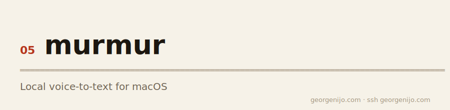

<picture><source media="(prefers-color-scheme: dark)" srcset="docs/banner-dark.svg"></picture>

# Local Dictation

Privacy-first voice-to-text for macOS. Hold a key, speak, release — your words land in any app. No cloud, no subscriptions, no data leaves your machine.

Built with [Tauri 2](https://tauri.app/) (Rust + React), with local transcription through Core ML on the Apple Neural Engine, whisper.cpp on Metal, or sherpa-onnx on CPU.

## Features

- **100% local** — all transcription runs on-device. Audio and benchmark results never leave the machine
- **Apple Neural Engine default on Apple silicon** — multilingual Parakeet v3 through Core ML for very low-latency transcription; Intel Macs use the CPU fallback
- **Multiple local engines** — compare Core ML/ANE, whisper.cpp/Metal, and sherpa-onnx/CPU configurations
- **Performance Lab** — benchmark installed models on identical speech, including median/p95 latency, real-time speed, memory, and word error rate
- **Two recording modes** — Hold Down (hold to record, release to stop) or Double-Tap (tap twice to start, tap once to stop)
- **Clipboard-first output** — text always copied to clipboard. Optional auto-paste into your focused app
- **Floating overlay** — always-on-top widget with animated waveform, click to toggle recording
- **In-app model downloader** — first-launch onboarding downloads your chosen model with progress bar
- **Transcription history** — timestamped entries with copy-to-clipboard
- **Stats tracking** — total words, average WPM, total recordings, approximate tokens
- **System tray** — color-coded status icon (idle / recording / processing)
- **Log viewer** — last 200 lines with color-coded levels, per-transcription timing
- **MIT licensed** — use it, fork it, build on it

## Installation

1. Download the latest `.dmg` from the [Releases](https://github.com/georgenijo/murmur-app/releases) page
2. Open the DMG and drag **Local Dictation** to your Applications folder
3. Launch the app — if no model is found, the onboarding screen will guide you through downloading one

### Permissions

Grant these in **System Settings > Privacy & Security** when prompted:

| Permission | Required for |
|------------|-------------|
| Microphone | Recording your voice |
| Accessibility | Keyboard detection + auto-paste |

## Models

Choose a model based on your speed/accuracy tradeoff. Models download automatically on first launch, or you can switch models in Settings at any time.

| Model | Engine | Accelerator | Size | Notes |
|-------|--------|-------------|------|-------|
| Parakeet v3 | Core ML | Apple Neural Engine | ~470 MB | Apple silicon default, multilingual, lowest latency |
| Parakeet v2 | sherpa-onnx | CPU | ~1.2 GB | English fallback, including Intel macOS |
| Whisper Tiny | whisper.cpp | Metal GPU | ~75 MB | English |
| Whisper Base | whisper.cpp | Metal GPU | ~150 MB | English |
| Whisper Small | whisper.cpp | Metal GPU | ~500 MB | English |
| Whisper Medium | whisper.cpp | Metal GPU | ~1.5 GB | English |
| Whisper Large Turbo | whisper.cpp | Metal GPU | ~3 GB | Multilingual |

Open **Settings > Performance** to benchmark installed configurations on your
machine. Accuracy is measured as word error rate against bundled speech with
known reference transcripts.

## Recording Modes

Configure in the Settings panel:

**Hold Down** — hold a modifier key (Shift, Option, or Control) to record. Release to stop and transcribe.

**Double-Tap** — quickly double-tap a modifier key to start recording. Single tap to stop. The detector rejects held keys, modifier+letter combos, slow taps, and triple-tap spam.

Transcribed text is always copied to your clipboard. Enable **Auto-Paste** in Settings to have it pasted automatically into your focused app.

## Tech Stack

| Layer | Technology |
|-------|-----------|
| App framework | Tauri 2 |
| Backend | Rust |
| Frontend | React 18, TypeScript, Tailwind CSS 4 |
| Transcription | FluidAudio/Core ML, whisper-rs/Metal, sherpa-onnx/CPU |
| Audio capture | cpal |
| Keyboard listener | rdev |
| Clipboard | arboard |
| Auto-paste | osascript |
| Build tool | Vite 6 |

## Building from Source

```bash
git clone https://github.com/georgenijo/murmur-app.git
cd murmur-app/app
npm install
npm run tauri dev        # Dev with hot reload
npm run tauri build      # Production .app and .dmg
```

Requires macOS 12+, [Node.js](https://nodejs.org/) 18+, and [Rust](https://rustup.rs/) (latest stable).

### Running Tests

```bash
cd app/src-tauri && cargo test -- --test-threads=1   # Rust unit tests
cd app && npx tsc --noEmit                            # TypeScript type check
```

## Architecture

```
Hotkey (rdev) → Audio Capture (cpal) → Local Transcription Engine → Clipboard (arboard) → Auto-Paste (osascript)
       ↕                    ↕                        ↕                                    ↕
   Frontend (React) ←——— Tauri IPC ———→ Rust Backend ———→ System Tray + Overlay
```

The backend uses a `TranscriptionBackend` trait — a clean interface that makes it easy to add new transcription engines in the future.

## License

[MIT](LICENSE)
