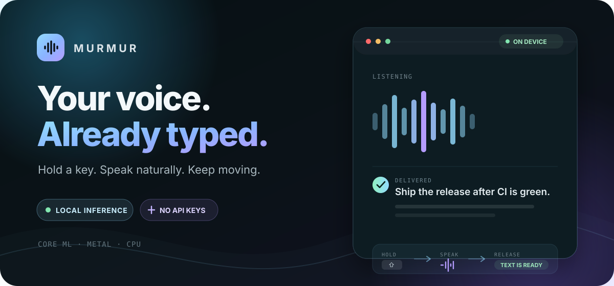
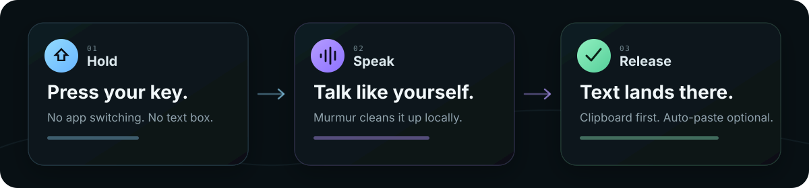
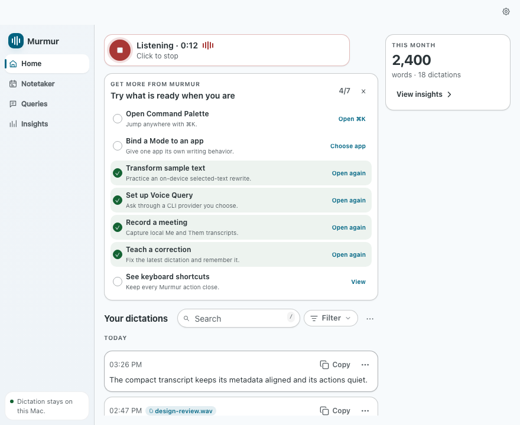

<p align="center">
  
</p>

<p align="center">
  <a href="https://github.com/georgenijo/murmur-app/releases/latest"></a>
  <a href="#build-from-source"></a>
</p>

<p align="center">
  <a href="https://github.com/georgenijo/murmur-app/releases/latest"></a>
  <a href="https://github.com/georgenijo/murmur-app/actions/workflows/ci.yml"></a>
  <a href="LICENSE"></a>
</p>

<p align="center">
  <strong>No cloud inference. No API keys. No subscription.</strong><br>
  <sub>Speech and rewriting stay on your machine. Release builds send privacy-stripped diagnostic metadata by default—never audio or text. <a href="#privacy-without-the-hand-waving">Details and opt-out.</a></sub>
</p>

## Talk. Don't type.

Murmur is the keyboard shortcut for the thought you already finished having.
Hold a key, say it naturally, and release. Your words show up in the app you
were already using—cleaned up, copied, and ready to send.

<p align="center">
  
</p>

## More than a transcription box

<table>
  <tr>
    <td width="33%" valign="top">
      <h3>⚡ Feels instant</h3>
      <p>Parakeet on the Apple Neural Engine by default. The model warms while you speak, not after.</p>
    </td>
    <td width="33%" valign="top">
      <h3>✨ Comes out clean</h3>
      <p>Filler removal, punctuation, structure, numbers, corrections, and formatting—all deterministic and local.</p>
    </td>
    <td width="33%" valign="top">
      <h3>📋 Works anywhere</h3>
      <p>Clipboard first, with optional auto-paste. Notes, chat, email, terminals, editors—stay in flow.</p>
    </td>
  </tr>
  <tr>
    <td width="33%" valign="top">
      <h3>🧠 Learns your language</h3>
      <p>Teach names, jargon, code symbols, snippets, and per-app writing styles without training a cloud model.</p>
    </td>
    <td width="33%" valign="top">
      <h3>🪄 Rewrites by voice</h3>
      <p>Select text, say “make this sharper,” review the local LLM's diff, then approve—or don't.</p>
    </td>
    <td width="33%" valign="top">
      <h3>🛡️ Built to fail closed</h3>
      <p>Secure fields, ambiguous corrections, stale async work, and unknown models are refused instead of guessed.</p>
    </td>
  </tr>
</table>

## The app gets out of your way

<picture>
  <source media="(prefers-color-scheme: dark)" srcset="app/visual-tests/main-window.spec.ts-snapshots/dark-recording-darwin.png">
  
</picture>

The main window is a searchable transcript workspace, not a giant Record
button. A notch-anchored overlay gives you status, waveform, and quick controls
without stealing focus. Drag in WAV, MP3, or M4A files when you want the same
local transcription pipeline without the microphone.

## Pick your rhythm

| Hold | Tap | Go hands-free |
|---|---|---|
| Hold a modifier, speak, release. | Double-tap to start; tap once to stop. | Let trailing silence finish toggle-started recordings. |

Use **Hold Down**, **Double-Tap**, or **Both** on Left Shift, Left Option, or
Right Control. Murmur rejects modifier-plus-letter shortcuts, long taps, slow
double-taps, and repeated-key noise so normal typing stays normal.

## Say it better, without starting over

Selected-text **Transform** turns voice into an editing gesture:

> Select a paragraph → hold the Transform key → say “shorter and more direct” →
> inspect the word diff → Approve, Retry, Cancel, or Undo.

The pinned Qwen2.5-1.5B model runs in a separately signed, sandboxed llama.cpp
helper with no network entitlement. It never auto-applies. Secure fields and
unprovable Accessibility states fail closed.

[See how Transform handles native, browser, and Electron apps →](docs/features/selected-text-transform.md)

## Install in a minute

1. [Download the latest `.dmg`](https://github.com/georgenijo/murmur-app/releases/latest).
2. Drag **Murmur** into **Applications**.
3. Launch it. The setup assistant handles Microphone, Accessibility, hotkey
   choice, and the first local model.

> [!IMPORTANT]
> Launch Murmur from Applications—not permanently from the disk image. macOS
> App Translocation can make a quarantined copy read-only and block updates.

| Platform | Experience |
|---|---|
| **Apple Silicon · macOS 14+** | Everything: Core ML/ANE, Metal, Transform, native Accessibility, notch overlay, signed updates |
| **Linux** | `.deb` and AppImage with core dictation through CPU Parakeet or Whisper; macOS-only surfaces and Transform are unavailable |
| **Intel Mac / Windows** | Not supported |

---

## Go deeper

Everything below is for the curious, the cautious, and the people about to
open a pull request.

<details>
<summary><strong>🎛️ Seven local transcription models</strong></summary>

Models install on demand and switch from Settings. Murmur prepares the selected
model while recording and keeps it warm according to the configured idle policy.

| Model | Runtime | Accelerator | Size | Language |
|---|---|---:|---:|---|
| Parakeet TDT 0.6B v3 | FluidAudio / Core ML | Apple Neural Engine | ~470 MB | Multilingual |
| Parakeet TDT 0.6B v2 | sherpa-onnx | CPU | ~1.2 GB | English |
| Whisper Tiny | whisper.cpp | Metal GPU | ~75 MB | English |
| Whisper Base | whisper.cpp | Metal GPU | ~150 MB | English |
| Whisper Small | whisper.cpp | Metal GPU | ~500 MB | English |
| Whisper Medium | whisper.cpp | Metal GPU | ~1.5 GB | English |
| Whisper Large v3 Turbo | whisper.cpp | Metal GPU | ~3 GB | Multilingual |

Parakeet v3 is the Apple Silicon default. **Settings → Model → Benchmark**
compares installed configurations using latency, real-time factor, memory, and
raw/normalized/delivered word error rate on your machine.

</details>

<a id="privacy-without-the-hand-waving"></a>
<details>
<summary><strong>🔒 Privacy without the hand-waving</strong></summary>

Murmur's boundary is based on data type—not a misleading “never touches the
network” claim.

| Data | What happens |
|---|---|
| Microphone audio | Processed locally; never uploaded. Written only when **Save Audio to File** is on |
| Dictated text | Transcribed and transformed locally; excluded from diagnostic uploads |
| Selected text, instructions, proposals | Handled by the sandboxed local sidecar; never sent to a hosted model or normal logs |
| History and usage | Local `localStorage`, with a rolling 200-entry history cap |
| Knowledge and learned rules | Local SQLite; inspectable, exportable, and deletable in Settings |
| Performance diagnostics | Content-free, bounded local SQLite history; clearable in Settings |
| Models and app updates | Downloaded from pinned release/model sources |

Production builds upload privacy-stripped structured events for support. They
include timing, state, stable error codes, pipeline outcomes, a random install
ID, computer name, macOS version, and bounded hardware facts. They exclude
audio, transcript text, selected text, rewrite content, knowledge values,
project paths, and clipboard content. Development builds do not upload.

Set `MURMUR_LOG_SHIPPER=off` in Murmur's launch environment to opt out. Detailed
capture-hang bundles remain dormant unless that specific installation is armed
with its owner's agreement, and collection is recorded in the local event log.

[Full log-shipping contract](docs/features/log-shipping.md) ·
[Performance diagnostics](docs/features/performance-diagnostics.md)

</details>

<details>
<summary><strong>⚙️ Under the hood</strong></summary>

```text
Global hotkey
    │
    ▼
Rust/Tauri coordinator ───────► signed capture worker (CPAL / AUHAL)
    │                                      │
    │ policy + generation ownership        │ 16 kHz mono PCM
    │                                      ▼
    └──────────────► Silero VAD ─► local ASR backend
                                      │
                                      ▼
                         ordered transcript pipeline
                                      │
                                      ▼
                         clipboard ─► paste / files

Selected text ─► AX capture ─► instruction ASR ─► local-LLM sidecar
                                                        │
                                                        ▼
                                               review ─► approved apply
```

Production microphone ownership is isolated in a signed, killable process. The
main app owns policy and retained PCM; the worker owns macOS audio objects. A
blocked Core Audio call can be bounded and its exact process group terminated
without stale capture work overwriting a newer recording.

Every backend uses one `TranscriptionBackend` interface, then one ordered
pipeline:

```text
cleanup → voice commands → smart correction → smart formatting
        → spoken structure → spoken numbers → IDE context → CLI formatting
```

Monotonic generation IDs and immutable recording snapshots guard asynchronous
work. The rewrite LLM remains out of process because llama.cpp and whisper.cpp
vendor incompatible ggml runtimes.

[Read the architecture guide →](docs/ARCHITECTURE.md)

</details>

<a id="build-from-source"></a>
<details>
<summary><strong>🛠️ Build from source</strong></summary>

### Prerequisites

- Apple Silicon Mac with macOS 14+ for the full app
- Xcode Command Line Tools and [CMake](https://cmake.org/)
- [Node.js](https://nodejs.org/) 18+, [Rust](https://rustup.rs/) stable, Python 3

```bash
git clone https://github.com/georgenijo/murmur-app.git
cd murmur-app

# Required first on Apple Silicon macOS; builds all four bundled helpers.
python3 scripts/build_local_llm_sidecar.py

cd app
npm ci
npm run tauri:dev
```

The helpers are gitignored Tauri `externalBin` files. On macOS, a fresh clone
cannot run `tauri dev`, `tauri build`, `cargo check`, or `cargo test` until they
exist. Build a production app and DMG with `npm run tauri:build`.

### Test

```bash
cd app
npx tsc --noEmit
npm test
npx playwright install chromium  # first run only
npm run test:visual

cd src-tauri
cargo fmt --all -- --check
cargo test -- --test-threads=1

cd ../..
python3 -m unittest discover -s tests
```

Model- and microphone-backed suites are explicit opt-ins. See
[docs/DEVELOPMENT.md](docs/DEVELOPMENT.md) for permissions, integration tests,
logs, production builds, and troubleshooting.

</details>

<details>
<summary><strong>🗺️ Repository map</strong></summary>

```text
murmur-app/
├── app/
│   ├── src/                         React UI, hooks, settings, pure logic
│   └── src-tauri/
│       ├── src/                     Rust app, capture policy, ASR, transforms
│       ├── sidecars/capture/        Signed capture helper/worker
│       ├── sidecars/local-llm/      Sandboxed llama.cpp rewrite helper
│       ├── crates/                  Versioned helper protocols
│       └── tests/                   Rust integration suites
├── bench/                           Speech/accuracy fixtures
├── docs/                            Architecture, features, ADRs, references
├── infra/log-receiver/              Privacy-bounded diagnostics receiver
├── scripts/                         Build, signing, release, and QA tooling
├── tests/                           Workflow/artifact policy tests
└── tools/murmur-diag/               Local diagnostics inspection tool
```

</details>

## Explore the docs

[**Features**](docs/FEATURES.md) ·
[**Architecture**](docs/ARCHITECTURE.md) ·
[**Development**](docs/DEVELOPMENT.md) ·
[**First run**](docs/onboarding.md) ·
[**Commands & events**](docs/reference/) ·
[**Decisions**](docs/decisions/DECISIONS.md) ·
[**Changelog**](CHANGELOG.md) ·
[**Releases**](docs/release.md)

## License

Murmur is [MIT licensed](LICENSE). Third-party licenses and attributions live
in [THIRD_PARTY_NOTICES.md](THIRD_PARTY_NOTICES.md).
