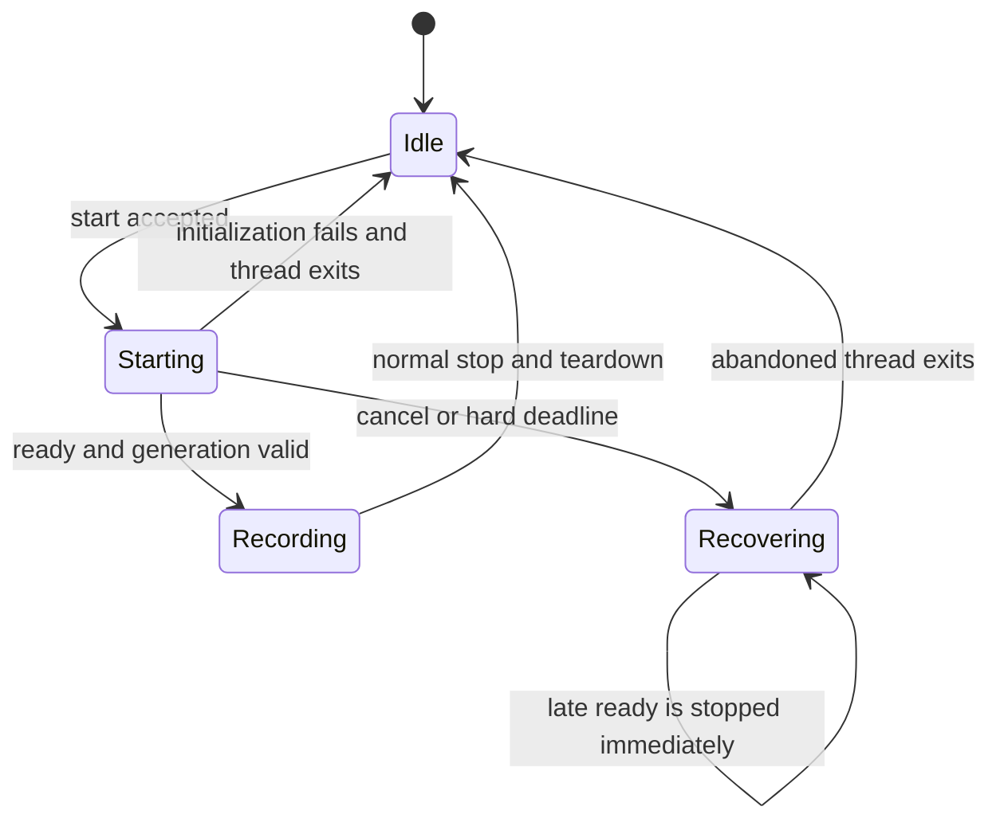

# Audio Initialization Lifecycle — Final Plan

Final convergence of `audio-init-converged-plan.md` and
`audio-initialization-lifecycle-plan.md` (2026-07-28). Supersedes both.

## Incident context

Log session on the MacBook Air, 2026-07-28 14:20–14:29: coreaudiod went slow for
~9 minutes. Device opens took 10–12s against the hard 5s init timeout in
`start_recording` (`audio.rs:183`); six recordings failed silently; timed-out
init threads were forgotten and piled up, contending for the mic (two
`run_audio_capture` lines at 14:22:17.267/.385); an app restart at 14:22:24 did
not help — the wedge was OS-level. The stall moved between phases across
attempts (recording 7: stream build/play; recording 8: enumeration/config),
consistent with a wedged HAL rather than one slow call.

Known live bug found during review: `start_recording` holds the recording-state
mutex across the entire 5s `recv_timeout` (`audio.rs:139–192`), so a stalled
init also blocks `stop_recording` and every other audio call.

## Goal

Make microphone initialization asynchronous, single-owner, cancelable, and
honest about recovery. A timed-out Core Audio thread must remain owned until it
exits — never detached and forgotten. A slow device open becomes a slow start
that succeeds, not a failure to recover from.

## Required invariants

- At most one audio initialization or recording owns the microphone.
- Starting a recording never blocks a Tauri command for five seconds.
- A cancelled or expired attempt can never emit `recording`, audio levels, or
  samples.
- Murmur never returns to `Idle` while an old audio thread is still alive.
- Every spawned audio thread is eventually joined or remains explicitly tracked
  as unrecoverable.
- Recording duration begins when the stream becomes ready, not when
  initialization begins.
- No audio call ever waits on a channel while holding the recording-state
  mutex.

## Generation identity

The existing monotonic `recording_id` is the generation for the whole attempt.
No separate `audio_attempt_id`: with no automatic retry, every attempt is a new
`recording_id`, and a single counter follows the codebase's established
generation pattern. (If a future feature makes one recording span multiple
attempts, introduce the second counter then.)

## State machine

`Recovering` is essential. Returning directly to `Idle` after cancelling a
blocked initialization would allow a second thread and recreate the defect.

## PR 0 — Instrumentation and ownership under the existing synchronous API

Shippable alone, zero UI-visible behavior change, stops the thread pile-up on
day one even if the async work slips.

- **Phase timing**: log enter/exit around device enumeration → config lookup →
  stream build → `play()` → ready signal, tagged with `recording_id`. This
  lands *before* the rewrite so the incident stays measurable and becomes the
  dataset for tuning the deadlines later.
- **Generation-owned init**: on cancellation or timeout, mark the generation
  cancelled; flip `active` off so the callback stops accepting samples and
  stops emitting level events; **retain the thread handle** and reap it when it
  returns; a late `ready` from an expired generation gets an immediate `Stop`
  (closes the orange-dot flicker).
- **Single owner**: while any init is live (pending or draining), a new start
  is rejected fast with a typed error. Never queued — this is push-to-talk with
  immutable per-recording context; a start that fires seconds late records the
  wrong moment with the wrong context.
- **Mutex fix**: release the recording-state lock before waiting on `ready_rx`;
  re-acquire to commit the result. `stop_recording` must be callable while an
  init is stalled.

## PR 1 — Async lifecycle vertical slice

Backend state machine plus the minimum frontend contract, merged together —
the status contract change must be atomic.

### Backend

Replace synchronous `start_recording()` with a supervisor-owned attempt:

- Spawn the audio thread and return immediately; the supervisor owns the thread
  handle from spawn through exit/join.
- Store per-attempt origin, cancellation flag, active flag, command sender,
  timing, and lifecycle state, keyed by `recording_id`.
- Reject starts during `Starting` with `AlreadyStarting`; during `Recovering`
  with `AudioRecovering`.
- The worker reports structured lifecycle messages: phase entered, ready,
  initialization failed, stream stopped, thread exited.
- On `ready`, the supervisor checks the generation:
  - current and uncancelled → transition to `Recording`, set the real start
    time, emit `recording`;
  - cancelled or stale → flip `active` off, send `Stop`, suppress all frontend
    events, remain `Recovering` until the thread exits.
- **Model preparation fires when the start is accepted** (entering `Starting`),
  not on `ready`. Prep is mic-independent; warm-on-record's whole point is
  overlapping model load with other latency, and a slow device open must not
  serialize it. A wasted warm on a cancelled init is acceptable — the idle
  release path already reclaims it.

### Cancellation and deadlines

Separate user experience from cleanup:

- At ~5 seconds in `Starting`: emit a "still connecting" signal. Do not pretend
  initialization failed.
- User activation (toggle, hold release, double-tap) while `Starting`: cancel
  the attempt.
- At ~30 seconds: hard-cancel automatically and report initialization failure
  exactly once. This is a hard initialization deadline, not garbage
  collection — the thread remains owned after it fires.
- After cancellation: remain `Recovering` until the worker exits.
- No automatic retry. The user pressing the key again *is* the retry, and it is
  now safe. No retry loop may hammer a wedged HAL.
- Both deadline values are provisional: revisit them against real phase-timing
  distribution from PR 0 after a week in the field.

### Recording-mode behavior

- Hold release during `Starting` cancels.
- A second toggle/double-tap during `Starting` cancels.
- Silence auto-stop only arms after reaching `Recording`.
- Recording origin is preserved throughout `Starting`.
- Cancelled initialization creates no history entry, statistics, saved audio,
  or transcript.
- Context remains the immutable snapshot captured when the user initiated the
  recording.
- **Device switch or sleep/wake during `Starting` cancels the attempt — never
  adopt a stream across either event.**

### Minimum frontend contract

`useRecordingState` handles `starting`, `recording`, `recovering`, `idle`, and
terminal initialization failure. The overlay shows at least a basic starting
indication in this PR so the backend/frontend contract lands atomically.
Duration and stats derive from the readiness timestamp, never the init start.

## PR 2 — UX and diagnostics polish

Once lifecycle correctness is proven:

- Distinct pulse for `Starting`; after ~5s the indication changes to "still
  connecting."
- Toggle during `Starting` visibly cancels.
- Bounded microphone-failure flash via the existing `useOverlayRuntime` flash
  path.
- While `Recovering`, reject interaction with an actionable message rather than
  appearing idle.
- If recovery exceeds its grace period (thread never exits), surface persistent
  guidance in the existing recording-error surface. Wording must be honest:
  restarting Murmur clears the stuck thread — Rust cannot kill a thread blocked
  inside Core Audio — but macOS audio itself may still need to recover; do not
  promise the microphone will work after restart. (The incident logs show the
  coreaudiod wedge surviving an app restart.)
- Complete the privacy-safe phase telemetry begun in PR 0: `recording_id`,
  phase name and elapsed time, cancellation reason, readiness outcome, stop
  acknowledgment, thread-exit/join confirmation. Release logs continue
  redacting device names.

## PR 3 — Screen-notification coalescing (independent, ship anytime)

- Trailing 100–150ms debounce on screen-parameters-changed.
- Compare the complete display snapshot: notch geometry, monitor bounds,
  origin, scale. Reposition and emit `overlay-geometry-changed` only when the
  snapshot changes — debouncing alone would still process isolated identical
  notifications.
- Log one coalesced event instead of every native notification. (Incident log:
  ~60Hz notification storm for over a second at 13:58, each firing a full notch
  re-detection and reposition.)

## Tests

Injected audio-initialization seam simulating blocking before device lookup,
stream construction, and `play()`. Required cases:

- Start returns promptly while initialization remains blocked.
- A second start never spawns another worker.
- `stop_recording` is not blocked while an init is stalled (mutex fix).
- Cancel during `Starting` enters `Recovering`.
- Late readiness after cancellation is stopped and never emits `recording`.
- `Idle` is not restored until the worker exits.
- Hard deadline emits failure exactly once.
- Stale generations cannot mutate current state.
- Duration begins at readiness.
- Successful retry works after complete teardown.
- Model preparation starts on start-accepted, not on readiness.
- Hold, toggle, double-tap, and silence-auto-stop semantics remain correct.
- Device switch and sleep/wake during `Starting` cancel cleanly.
- No samples or level events escape from abandoned attempts.

Native smoke: rapid overlay clicks and hold-key mashing; logs must never show
overlapping `run_audio_capture` lines. Suspending `coreaudiod`
(`sudo killall -STOP coreaudiod` / `-CONT`) is a documented manual stress test
only — never automated CI — and must demonstrate a 12s device open ending in a
successful recording.

## Acceptance criteria

- No synchronous five-second wait in the start command.
- No forgotten or detached audio thread handles.
- One microphone owner at all times.
- Slow startup is visible and cancelable; a slow-but-successful open produces a
  working recording.
- Late initialization cannot resurrect a cancelled recording.
- Recovery messaging is truthful when Core Audio remains blocked.
- Deadline values re-examined against PR 0 phase-timing data before being
  considered final.
- All recording modes pass the deterministic tests and native
  rapid-interaction smoke testing.

## Resolved disagreements (for the record)

- **`Recovering` state, two-tier 5s/30s signaling, duration-at-readiness,
  mutex fix**: adopted from the lifecycle plan.
- **Model prep at start-accepted** (not on ready): overlap preserved;
  lifecycle plan overruled.
- **Phase timing and measure-then-tune moved to PR 0**: instrumentation
  precedes the rewrite; lifecycle plan overruled.
- **Sleep/wake and device-switch cancellation reinstated** in behavior and
  tests.
- **Restart guidance kept but scoped and reworded** to not promise recovery.
- **Single generation counter** (`recording_id`); no separate attempt ID.
- **PR 0 split kept** (George may veto: folding PR 0 into PR 1 changes nothing
  else in this plan).
