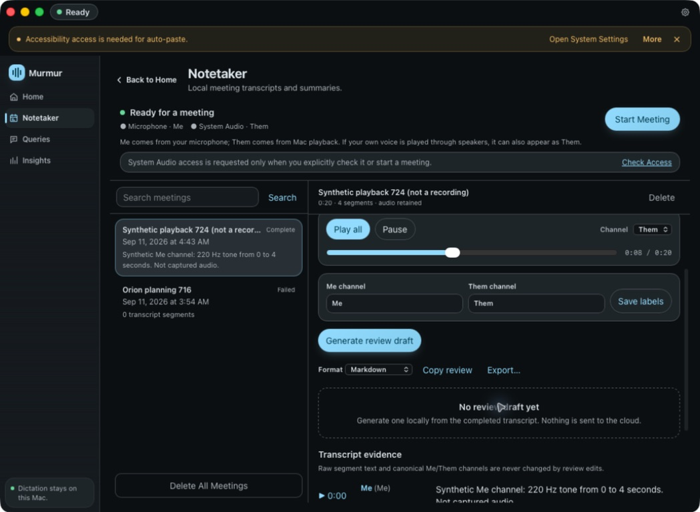
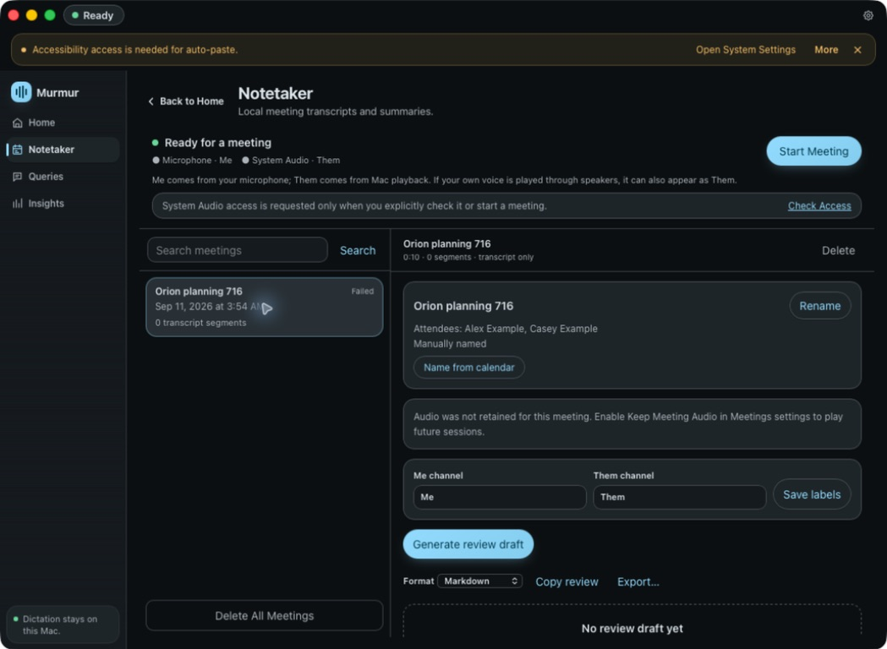

# Retained meeting audio verification

The native playback fixture is explicitly synthetic. It checks the playback
path independently of the macOS capture permission gate and does not prove
that recording succeeded.

## Reproduce the fixture

1. Build and sign the isolated `Murmur Meetings Test` debug app with bundle ID
   `com.localdictation.meetings716`, then launch it once to initialize its store.
2. Stop that app and its capture worker.
3. Run `python3 docs/qa/meeting-audio-playback/seed_native_fixture.py`.
4. Launch the same app and select **Synthetic playback 724 (not a recording)**
   in Notetaker.

The script refuses a running test app, a different database schema, symlinked
store paths, and an existing fixture. It only writes inside the isolated test
bundle's data directory. Delete the fixture through the app before reseeding.

| Channel | Start | End | Synthetic audio |
| --- | --- | --- | --- |
| Me | 0:00 | 0:04 | 220 Hz tone |
| Them | 0:07 | 0:12 | 660 Hz tone |
| Me | 0:09 | 0:13 | 330 Hz tone |
| Them | 0:17 | 0:20 | 880 Hz tone |

Clicking the second segment should select **Them** and begin at **0:07**.
**Play all** should preserve the 0:09–0:12 overlap and both silent gaps. Pause,
resume, channel changes, and keyboard seeking should retain the global session
position. Deleting the selected session should stop playback and remove all
four WAVs from its audio directory.

## Native status

The signed native debug build passed these Computer Use checks:

- Clicking the Them segment began at 0:07 (observed at 7,200 ms after startup)
  and selected Them. Clicking the Me segment began at 0:09 (observed at 9,200 ms)
  and selected Me.
- Play all selected All, started at zero, and reached the 0:20 endpoint without
  a playback error. Pause worked. Keyboard Tab reached the seek
  slider; Home followed by Right moved it to 100 ms while paused.
- Confirming deletion during playback removed the player and session. A
  read-only database/filesystem check confirmed zero session/segment rows and
  removal of the entire four-WAV fixture directory.
- The earlier failed session created with retention off showed no player and
  the explanation that its audio was not retained.

[Me playback](native-me-transport.jpg), [whole-session completion](native-playback-complete.jpg),
[deletion](native-deleted.jpg), and the [deletion check](native-deletion-check.json)
provide the remaining evidence.

Real retained capture is **not verified**. With Keep Meeting Audio enabled,
two attempts using `afplay` failed after about eight seconds with a Core Audio
startup stall and no saved segments. Retrying with BlackHole as the temporary
output did not resolve it; Mac mini Speakers was restored afterward. The cause
of the startup stall is unconfirmed. Computer Use also rejects interaction with
the protected macOS permission and authentication dialogs.

The [enabled retention setting](native-retain-enabled.jpg) and
[capture failure](native-capture-stalled.jpg) record this gap. The PR remains a
draft; the synthetic fixture is not evidence that recording succeeded.

## Automated verification

- `cargo fmt --all`, `cargo check`, and workspace Clippy with warnings denied passed.
- `cargo test -- --test-threads=1`: 1,424 passed, 9 ignored.
- `npx tsc --noEmit` passed.
- `npm test`: 1,430 passed across 149 files.
- Python reference-document and release-artifact checks: 54 passed.
- Meeting visual tests: 4 passed, with 7 screenshot assertions.
- Independent Astra review at high effort: all three findings fixed and rechecked; no open code findings.

The checks cover bounded range reads, file and session ownership, WAV format,
symlink and hardlink refusal, deletion failures and retry, unrelated deletion,
overlap and gaps, buffering without dropped audio, late reads and decoding,
recording-state hydration, transform capture ordering, and playback availability
when the selected meeting finishes.
