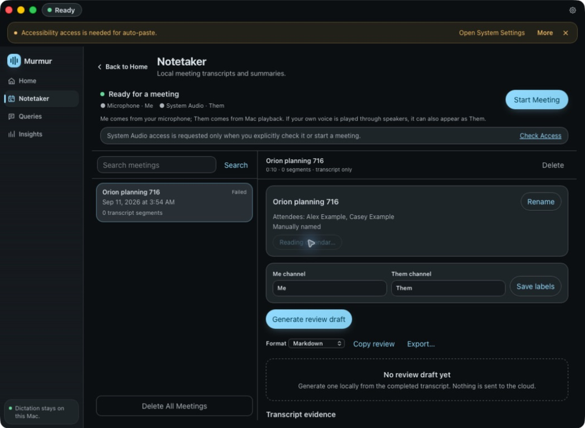

# Calendar naming native verification

On 2026-09-11, the issue #717 debug app was built, signed with the existing Developer ID identity and hardened runtime, and launched as `com.localdictation.meetings716`. `codesign --verify --deep --strict` passed. The signed host contains the Calendar entitlement; every helper excludes it. The local LLM is a nonfunctional test stub, as requested for this stack.

Calendar.app imported a synthetic **Murmur calendar smoke 717** event for 3:00–6:00 AM into a dedicated **Murmur smoke tests** calendar. The import used example.invalid attendee addresses with RSVP disabled. No send or invitation-response action was taken.

Computer Use selected the existing failed capture session and clicked **Name from calendar**. The app initiated Calendar authorization and remained at **Reading calendar…** awaiting the macOS response. The manual **Rename** action remained available. The OS permission/authentication processes are blocked by the Computer Use tool, and a local handoff is outstanding.

This verifies the signed entitlement configuration and the native action reaching its permission boundary. It does **not** establish successful EventKit lookup/application, denied-path interaction, or a successful meeting recording. Automated tests and separately labeled browser fixtures cover those states without claiming native success.

