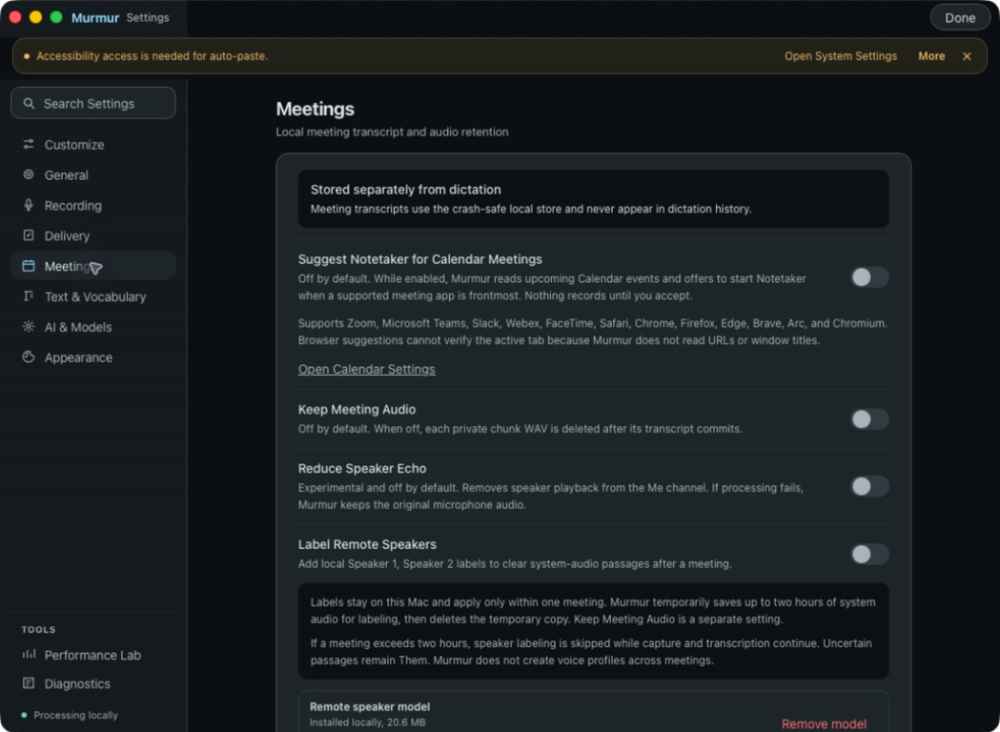

# Meeting suggestions verification

Issue #718 was checked on the Mac using the signed debug app built from this branch.

## Native observations

- The Meetings setting starts off and explains the Calendar reads, supported apps, and browser limitation.
- Toggling it on reached the macOS Calendar permission request. Toggling it off restored the disabled setting while that request was pending.
- The screenshot is from the native WKWebView, not a browser fixture.
- The signed host has the Calendar entitlement; capture helpers do not.

The positive Calendar → suggestion → Accept flow is **not verified**. Computer Use refuses interaction with the protected macOS permission and authentication dialogs. Native one-prompt behavior, event-title capture, and suppression during active dictation therefore remain pending local permission approval. The PR remains a draft.

## Automated evidence

- `cargo fmt --all`, `cargo check`, and workspace Clippy with warnings denied passed.
- `cargo test -- --test-threads=1`: 1,411 passed, 9 ignored.
- `npx tsc --noEmit` passed.
- `npm test`: 1,400 passed across 146 files.
- Reference-document and release-artifact Python checks: 54 passed.
- Suggestion overlay visual check: 1 passed. Meetings settings rhythm checks: 2 passed.
- Independent Astra review at high effort: three findings fixed and rechecked; no remaining actionable findings.

The tests cover disabled-state Calendar query suppression, event deduplication, busy admission, cancellation and stale work, Calendar contention recovery, consent persistence, ordered configuration, native geometry acknowledgment, and visible Accept failure recovery.

The [overlay snapshot](../../../app/visual-tests/main-window.spec.ts-snapshots/synthetic-meeting-suggestion-overlay-darwin.png) uses explicitly synthetic Calendar data. It proves layout only and does not establish native Calendar permission or capture behavior.
