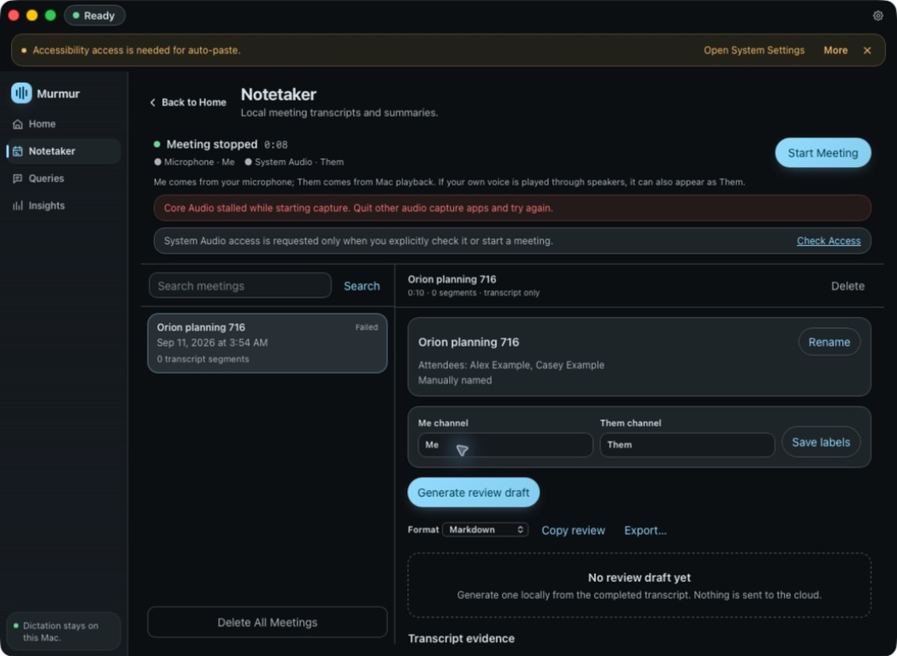
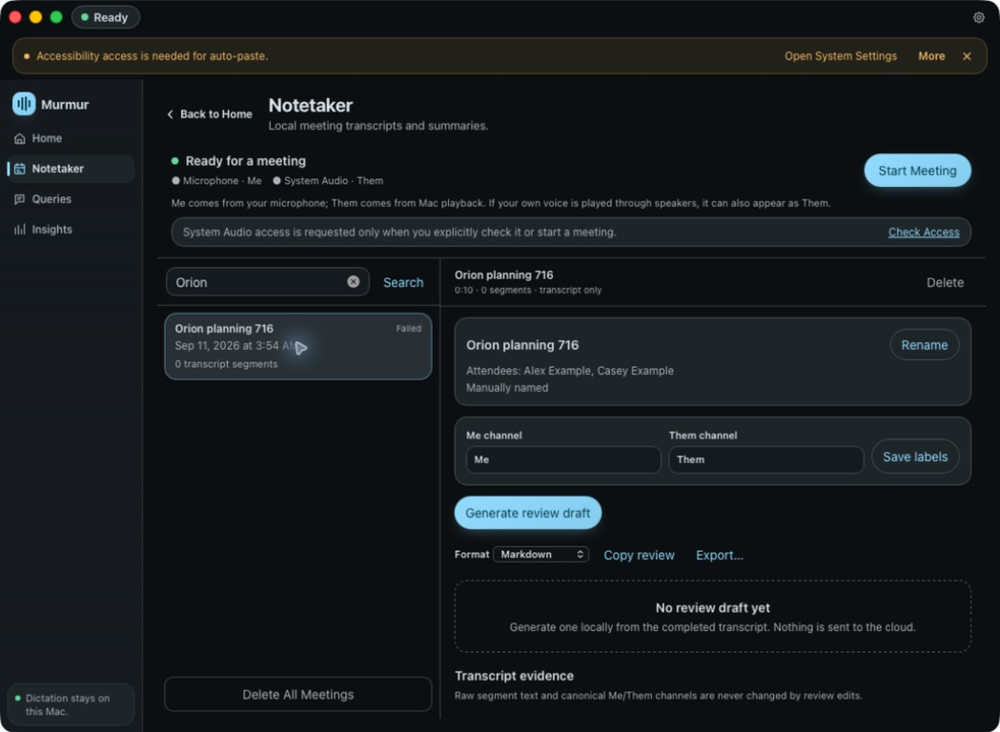

# Meeting title native verification

The isolated `com.localdictation.meetings716` app was built from issue #716 on this Mac and driven with Computer Use on 2026-09-11.

- Installed BlackHole 2ch as a test input because the Mac has no hardware microphone. System output remained Mac mini Speakers.
- Clicked Start Meeting and played generated speech with `afplay`.
- Capture stalled during Core Audio startup while macOS permission dialogs remained pending. The session is failed and contains zero speech segments. This does **not** establish the requested successful recording smoke.
- Named that test session **Orion planning 716**, with **Alex Example** and **Casey Example** as attendees.
- Copied Markdown through the native app and checked that it contained the title and both attendees.
- Restarted the app, searched for **Orion**, and selected the matching session. The title, manual source, and attendees persisted; a read-only SQLite check confirmed them.

The screenshots contain only synthetic test metadata. Successful capture remains pending. Computer Use rejected interaction with macOS UserNotificationCenter and LocalAuthenticationRemoteService; local approval was requested.

