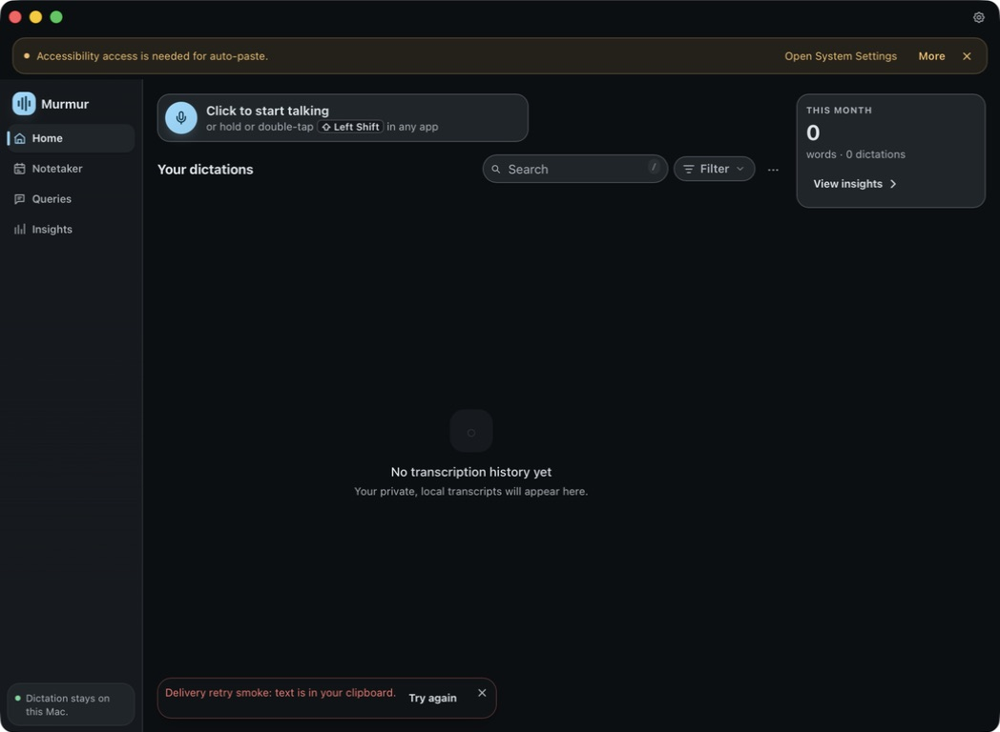
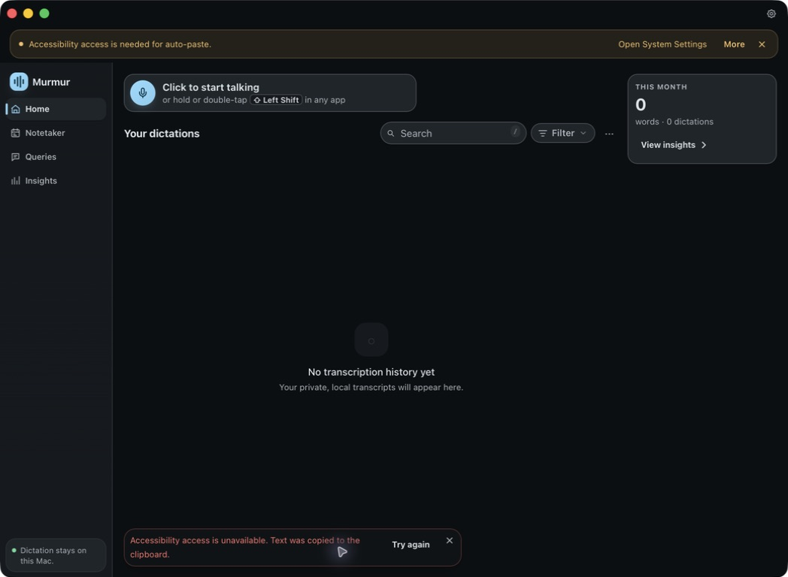
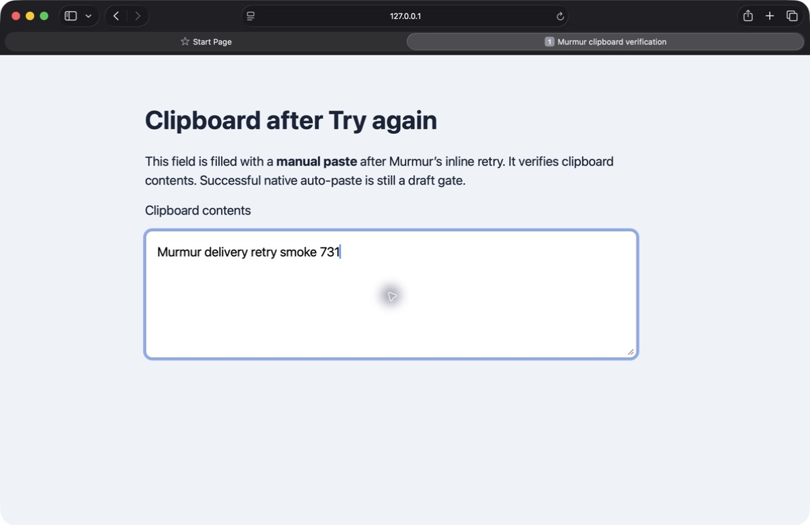
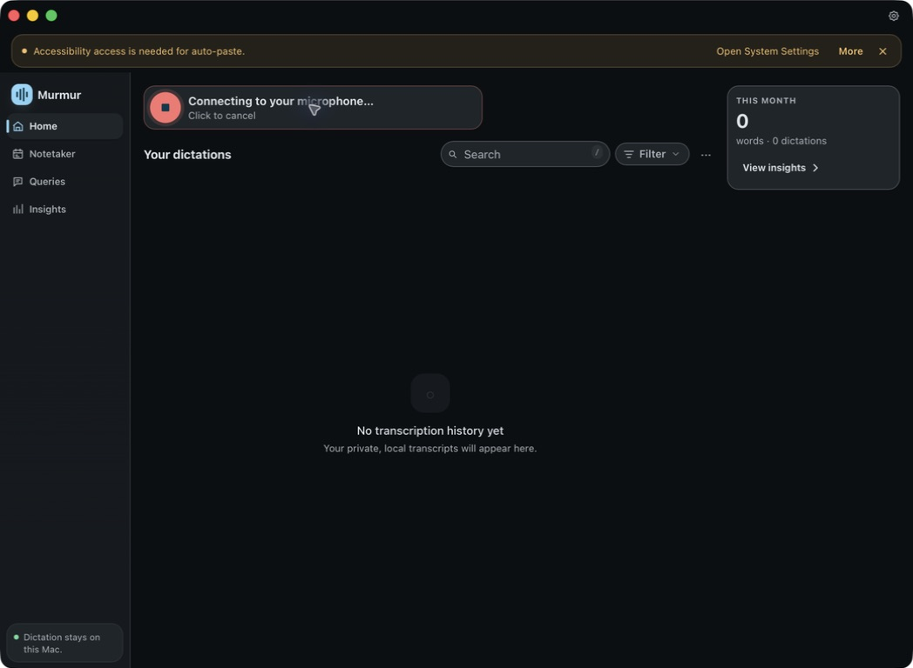

# Issue 731 native verification

Tested on the MacBook on 2026-09-11. Original implementation commit `64a0793759f108d0e5846f6c30ac9568e2f20369` passed the independent Astra review. Native inspection then found a clipped overlay label caused by a global unlayered button font reset; original typography commit `3593db478b8931e5bd21af3b0ab638fa229a62f4` uses an explicit local font contract and was rebuilt and verified in the actual overlay. After PR #743 was merged externally, those patch-equivalent commits rebased to `369be7ec681327a0ed164e5fbf2b28758f1f319b` and `116282c0590e4e6bd78b8272ec43c1c9bcdc414d` on `bf6c1aca8930aa497467ab31e2ce1a56e222ea3e`; range-diff found only the routine Unreleased-changelog composition that retains both issues' entries.

## Verified native subset

A temporary, uncommitted debug fixture wrote a fixed test string using the real clipboard writer, seeded the ordinary in-memory LastDelivery with an incomplete target, and emitted the existing failure/outcome events. The real frontend action, retry_last_delivery command, permission checks, target checks, clipboard writer, and result mapping were untouched. The fixture source was removed before the evidence commit.

Both native inline actions invoked the real command and returned clipboard_only. The main banner reported that Accessibility was unavailable and kept Try again. The overlay changed its confirmed green clipboard symbol to neutral amber retry feedback. The [content-free event receipt](native-retry-events.json) includes production pipeline.delivery_retry_terminal observations.

Before the main-window retry, a known sentinel was copied from Safari. After retry, a manual paste showed the retained string, proving that the real retry rewrote the clipboard. The screenshot labels this as manual clipboard verification; it does not claim automatic paste success. History and dictation counts stayed empty.

Final native overlay, before and after retry:

## Draft gate

The actual dev build was relaunched twice and still reported unavailable Accessibility. The orchestrator reported TCC Allow rows, but those stored rows did not establish current AX trust for the rebuilt ad-hoc app. A native capture attempt remained Connecting; content-free diagnostics reached AUHAL set_current_device at 54 ms without first PCM. The stalled dev app was quit.

Still required on a trusted running build: live microphone-to-delivery capture, a real auto-paste refusal followed by successful synthetic paste into the anchored target, and native focus-preservation confirmation during the overlay click. The fixture proves the retry UI/IPC/clipboard subset only. No permission or trust checks were bypassed.

## Validation

- cargo fmt --all and cargo check passed.
- cargo test -- --test-threads=1: 1,401 passed, 10 ignored, zero failed.
- npx tsc --noEmit passed; npm test: 145 files, 1,395 tests passed.
- Reference and Markdown checks: 30 tests passed; registered/documented command count is 201.
- Independent Astra high review: all four timer/generation/clipboard-status findings fixed and rechecked clean.
- Native app bundling completed; updater signing subsequently reported the expected missing private key. No updater is being published.
- Murmur Bench: N/A — presentation and invocation of the existing retry command do not change recognition, transcript transforms, or benchmarked execution paths.
- NotchPill integration is an external transcript-file mirror; this repository has no mirrored failure-cue or action callback surface to change.
