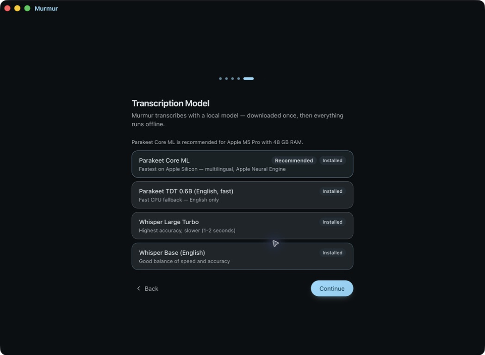
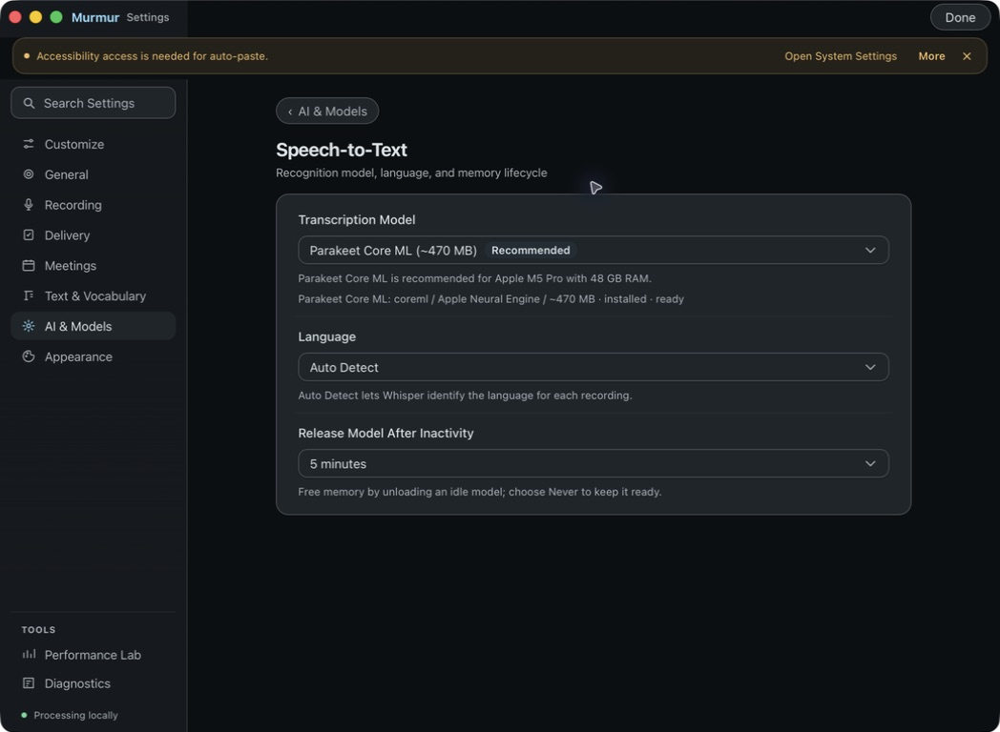
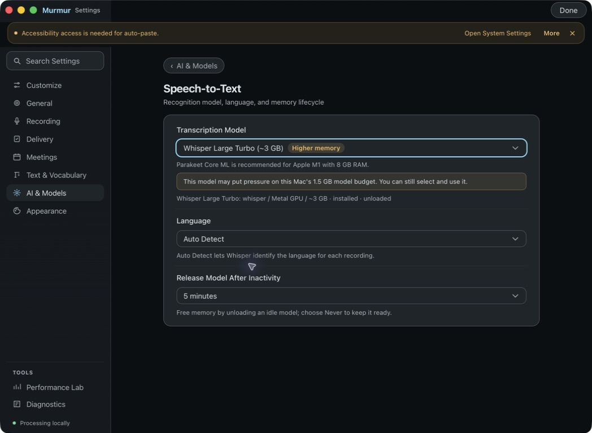
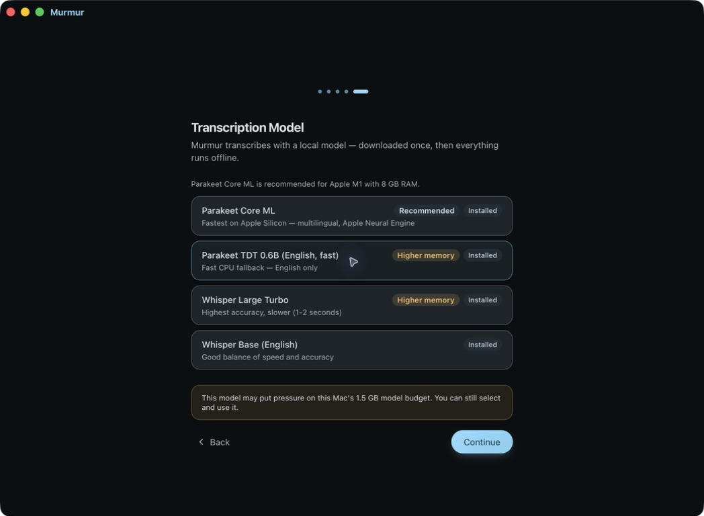

# Issue 732 native verification

Tested on the MacBook on 2026-09-11 using the native Local Dictation Dev app built from implementation commit `301544d24382cadfec544c571112b5fed717acee`.

## Detected hardware

The native `sysctlbyname` snapshot and `/usr/sbin/sysctl` agree: Apple M5 Pro, 51,539,607,552 physical bytes (48 GiB). Both onboarding and Settings recommend Parakeet Core ML, preserve its existing selection, and show no memory warnings. The model menu still exposes every catalog option.

## Supplementary low-memory fixture

This Mac cannot physically become an 8 GiB M1. A temporary, uncommitted substitution in the native cached guidance accessor returned the existing policy result for Apple M1 / 8 GiB. All model-picker, selection, and lifecycle code remained the reviewed implementation. The substitution was removed afterward; the committed Rust source matches the implementation commit.

In the native fixture build, Settings displayed Higher memory badges and accepted Whisper Large Turbo. Rerunning onboarding preserved that explicit selection. Selecting the warned CPU Parakeet option succeeded, and Continue advanced to the shortcut step. No download was necessary because these models were already installed.

## Validation

- `cargo fmt --all`, `cargo check`, and `cargo clippy --all-targets -- -D warnings`: passed.
- `cargo test -- --test-threads=1`: 1,401 passed, 10 ignored, zero failed.
- `npx tsc --noEmit`: passed.
- `npm test`: 144 files, 1,369 tests passed.
- Reference validator: 201 registered/documented commands; 5 reference regression tests passed.
- Reference and Markdown tests together: 30 passed; maintained Markdown links valid.
- Independent Astra high review: clean after fixing badge typography and stale recommendation wording.
- Native `.app` bundling completed. The CLI subsequently reported the expected missing updater private signing key; no updater artifact is being published.
- Murmur Bench: N/A — read-only model guidance and picker presentation do not change recognition, transcript transforms, delivery, or the model lifecycle.
